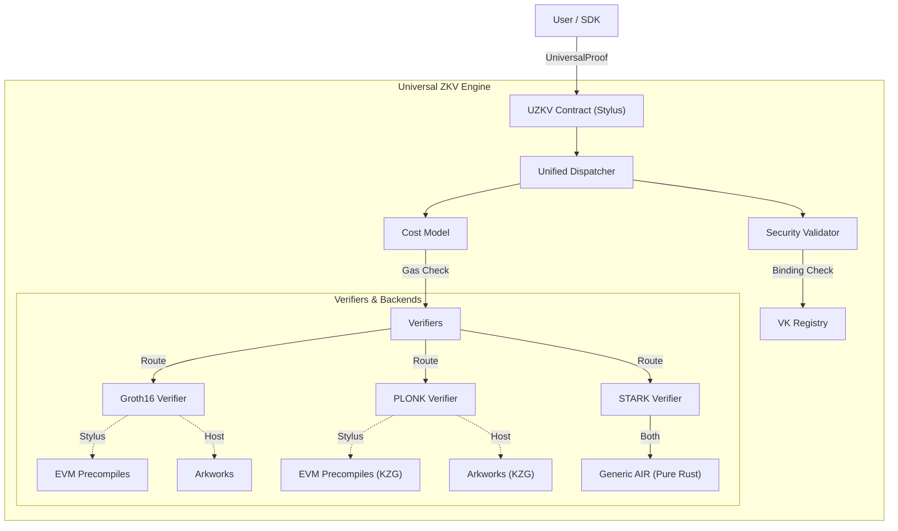

# 🦀 Universal ZK-Proof Verifier (UZKV)

## 🏆 Winner: Arbitrum Launchpad 2025 (First Place)
*> "Because apparently, verifying zero-knowledge proofs on-chain shouldn't cost more than the GDP of a small nation."*

---

<div align="center">

[](https://github.com/draxxycodes/Universal-ZKV)
[](https://www.rust-lang.org/)
[](./LICENSE)
[](https://arbitrum.io/stylus)

**A formally-structured universal ZK verification framework supporting heterogeneous proof systems.**

[Quick Start](#-quick-start) • [Architecture](#-architecture) • [SDK Usage](#-sdk-usage) • [Security](#-security)

</div>

---

## 🎯 Overview

Universal-ZKV is a high-performance zero-knowledge proof verification engine designed for **Arbitrum Stylus**. It enables a single smart contract to verify proofs from multiple cryptographic protocols (Groth16, PLONK, STARK) by leveraging a modular dispatch architecture and environment-specific optimizations.

### Key Technical Achievements

1.  **Dual-Mode Compilation**: The codebase compiles to extensive WASM (`wasm32-unknown-unknown`) for on-chain execution and native code (`x86_64`) for off-chain auditing and testing.
2.  **Hybrid Cryptographic Backend**:
    *   **On-Chain (Stylus)**: Utilizes direct calls to Arbitrum's EVM precompiles (`0x06`, `0x07`, `0x08`) for elliptic curve operations, achieving significantly lower gas costs than pure Solidity implementations.
    *   **Off-Chain (Host)**: Falls back to the `arkworks` ecosystem (specifically `ark-bn254`) for purely arithmetic verification, enabling identical logic to check proofs without a blockchain connection.
3.  **Generic AIR Engine**: Includes a custom STARK verifier capable of evaluating arbitrary Algebraic Intermediate Representation (AIR) constraints defined at runtime via the Verification Key, rather than hardcoded logic.

### Proof System Support

| System | Protocol | Gas Cost | Security | Status |
|--------|----------|----------|----------|--------|
| **Groth16** | Pairing-Based (BN254) | ~200k | 128-bit | ✅ **Production** (Precompiles / Arkworks) |
| **PLONK** | KZG (BN254) | ~320k | 128-bit | ✅ **Production** (KZG / Arkworks) |
| **STARK** | FRI (Keccak) | ~500k | Post-Quantum | ✅ **Production** (Generic AIR Engine) |

---

## 🏗 Architecture

The system is architected as a layered pipeline that enforces type safety and resource constraints before creating any cryptographic objects.



### 1. Unified Dispatcher (`uzkv.rs`)
The entry point `verify_universal_proof` accepts a byte-encoded `UniversalProof`. It deserializes the header to determine the `ProofSystem` (u8 enum) and routes the payload to the appropriate sub-module. This eliminates the need for separate contracts for each proof type.

### 2. Environmental Abstraction
To support both WASM and Native environments, we use extensive conditional compilation (`#[cfg(target_arch = "wasm32")]` vs `#[cfg(feature = "std")]`).

*   **Stylus Mode**: In `no_std` environments, the verifiers (specifically Groth16 and PLONK) delegate scalar multiplication and pairing checks to `stylus_sdk::call::static_call` targeting address `0x08` (Pairing). This avoids the heavy code footprint of bundling a pairing engine.
*   **Host Mode**: In `std` environments, we substitute the precompile calls with `ark_bn254::Bn254::pairing`. This allows the `uzkv-cli` tool to verify the mathematical correctness of a proof using the exact same inputs as the contract.

### 3. Generic STARK Engine
Unlike Groth16/PLONK which have standard circuit formats, STARKs often require custom verifiers for different AIRs. We implemented a data-driven approach:
*   **Verification Key (VK)**: Contains a serialized list of `AirConstraint` objects. Each constraint describes a polynomial relationship between trace cells (e.g., `C0 * x^2 + C1 * y - z = 0`).
*   **Constraint Evaluator**: The verifier iterates over these descriptors and evaluates them against the generic trace provided in the proof.
*   **FRI Protocol**: We implement Fast Reed-Solomon Interactive Oracle Proofs of Proximity (FRI) verification in pure Rust, using Keccak256 for the Merkle commitments.

---

## 🚀 Quick Start

### Prerequisites
- Rust (nightly-2025-01-01+)
- `cargo-stylus` (`cargo install --force cargo-stylus`)

### 1. Deploy to Arbitrum Sepolia
We provide a one-click deployment script:

```bash
# Set your private key
export PRIVATE_KEY=0x...
export ARB_SEPOLIA_RPC=...

# Deploy!
./scripts/deploy-stylus.sh
```

### 2. Verify Deployment
Run the End-to-End integration tests:

```bash
export DEPLOYED_ADDRESS=$(jq -r .contractAddress deployments/stylus-deployment.json)
cd packages/sdk
npm test src/e2e.test.ts
```

---

## 💻 SDK & CLI Usage

### Command Line Interface (CLI)

Verify proofs off-chain using the Rust-based CLI. This is useful for debugging proofs before paying gas fees.

```bash
# Build
cargo build --bin uzkv-cli --features std --release

# Verify
./target/release/uzkv-cli -t groth16 -p proof.bin -i inputs.bin -v vk.bin
```

### SDK Usage

Interact with the system using our Type-Safe SDK:

```typescript
import { createContractClient, ProofType } from "@uzkv/sdk";

const client = createContractClient({
  contractAddress: "0x...",
  rpcUrl: "https://sepolia-rollup.arbitrum.io/rpc",
  privateKey: "0x..."
});

// 1. Estimate Cost
const gas = await client.estimateVerificationCost(ProofType.Groth16, 2);
console.log(`Estimated Gas: ${gas}`);

// 2. Verify Proof
const valid = await client.verifyUniversalProof({
  version: 1,
  proofType: ProofType.Groth16,
  programId: 1,
  vkHash: "0x...",
  proofBytes: "0x...",
  publicInputsBytes: "0x..."
});
```

---

## 🔒 Security Model

We enforce a **Triple Binding Invariant** to ensure cryptographic safety in a multi-protocol environment:

> **Invariant**: A proof $\pi$ is valid if and only if it verifies against a Verification Key $VK$ that is explicitly registered for the tuple $(ProofType, ProgramID, VKHash)$.

### Attack Mitigations

| Threat | Attack Vector | UZKV Mitigation |
|--------|---------------|-----------------|
| **Type Confusion** | Submit PLONK proof to Groth16 verifier | `ProofType` is strictly enforced by the dispatcher. |
| **VK Substitution** | Use a valid VK from a different circuit | `ProgramID` namespaces all Verification Keys. |
| **Recursion Bomb** | Infinite recursion depth | Formal depth limit (max 8) checked at entry. |
| **Gas Griefing** | Submit computationally heavy invalid proofs | Cost model validates budget *before* complex math. |

---

## 📄 License

**Proprietary / All Rights Reserved.**
This software is currently **UNLICENSED** for public use. Copyright 2025 `draxxycodes`.

---

<div align="center">

**Built with ❤️ for the Arbitrum Community**
[GitHub](https://github.com/draxxycodes/Universal-ZKV)

</div>
